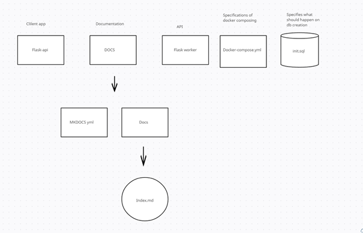
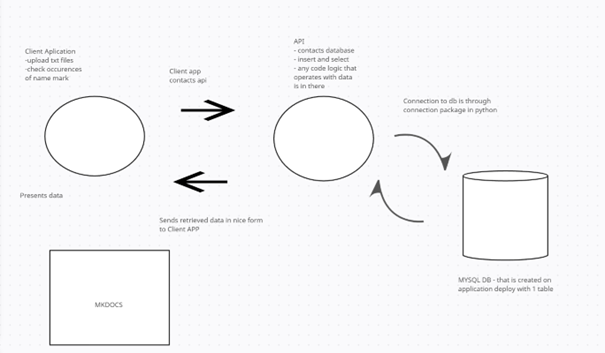

## Table of contents
* [komponenty](#komponenty)
* [use-case diagram](#use-case-diagram)
* [Setup](#setup)

## Setup
My Docker Project
Welcome to the documentation for my Docker project. This file provides an overview of the project and its features.

Prerequisites
Before getting started, ensure that you have the following prerequisites installed on your system:

Docker: Installation Guide
Installation
To install and run the project using Docker Compose, follow these steps:

Clone the repository: git clone https://github.com/your-username/your-project.git
Change into the project directory: cd your-project
Build the Docker images and start the containers: docker-compose up --build
Usage
Once the containers are up and running, you can access the project using the following URLs:

Web Application: http://localhost:5000
New App: http://localhost:3000
Configuration
The project uses a Docker Compose file (docker-compose.yml) to configure and orchestrate the containers. You can modify this file to customize the project's configuration, such as ports, volumes, environment variables, etc.

Database
The project includes a MySQL database container. The database is pre-configured with the following settings:

Database Name: names
Root Password: Vojtakropi21
You can connect to the database using your preferred MySQL client, such as MySQL Workbench or the MySQL command-line tool.

## komponenty

	
## use-case diagram

	

